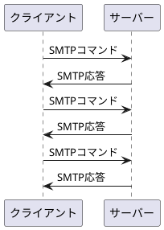
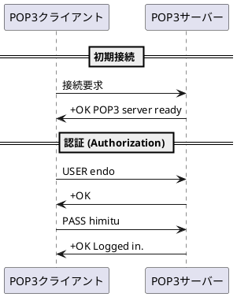
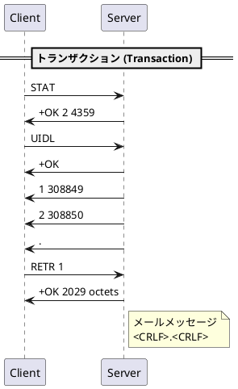
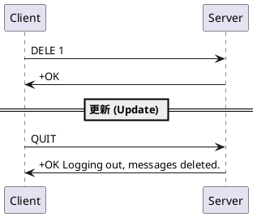

---
# You can also start simply with 'default'
theme: vuetiful
# random image from a curated Unsplash collection by Anthony
# like them? see https://unsplash.com/collections/94734566/slidev
# some information about your slides (markdown enabled)
title: メール勉強会第2回
info: |
  ## メール送受信プロトコル
# apply unocss classes to the current slide
class: text-center
# https://sli.dev/custom/highlighters.html
highlighter: shiki
# https://sli.dev/guide/drawing
drawings:
  persist: false
# slide transition: https://sli.dev/guide/animations#slide-transitions
transition: slide-left
# enable MDC Syntax: https://sli.dev/guide/syntax#mdc-syntax
mdc: true
---

# メール勉強会第2回
メールの送受信に使われているプロトコル


<div class="pt-12">
  <span @click="$slidev.nav.next" class="px-2 py-1 rounded cursor-pointer" hover="bg-white bg-opacity-10">
     次へ <carbon:arrow-right class="inline"/>
  </span>
</div>

<div class="abs-br m-6 flex gap-2">
  <button @click="$slidev.nav.openInEditor()" title="Open in Editor" class="text-xl slidev-icon-btn opacity-50 !border-none !hover:text-white">
    <carbon:edit />
  </button>
  <a href="https://github.com/slidevjs/slidev" target="_blank" alt="GitHub" title="Open in GitHub"
    class="text-xl slidev-icon-btn opacity-50 !border-none !hover:text-white">
    <carbon-logo-github />
  </a>
</div>

<!--
The last comment block of each slide will be treated as slide notes. It will be visible and editable in Presenter Mode along with the slide. [Read more in the docs](https://sli.dev/guide/syntax.html#notes)
-->

---
transition: fade-out
---

# 2-1 SMTPの通信

## メールの構造

- 📝 **エンベロープ**
  - メールの送信において、封筒に該当するもの
  - SMTPが使うのはエンベロープの情報です。
    - メール本文部分に書かれた送信者や受信者のメールアドレスを使うのでない！
  - エンベロープ from
    - メールを届ける相手が存在しない場合などには、エラーメールを配送するメールアドレスが指定され、**Return-Path**と言われることも
  - エンベロープ to
    - To, Cc, Bccなどとは別です
    - 一般的には、ToやCcの値が使われ、Bccで宛先を指定した場合には、エンベロープToにBccのアドレスを一つずつ指定して送信しています。
<br>
<br>

<!--
You can have `style` tag in markdown to override the style for the current page.
Learn more: https://sli.dev/guide/syntax#embedded-styles
-->

<style>
h1 {
  background-color: #2B90B6;
  background-image: linear-gradient(45deg, #4EC5D4 10%, #146b8c 20%);
  background-size: 100%;
  -webkit-background-clip: text;
  -moz-background-clip: text;
  -webkit-text-fill-color: transparent;
  -moz-text-fill-color: transparent;
}
</style>

<!--
Here is another comment.
-->

---
transition: slide-up
level: 2
---

#
##

- エンベロプのイメージ図

- メールヘッダー
  - 本文の前に付加される部分
  - メール送信日時
  - メールId
  - 経由したメールサーバーなどの情報
---
layout: default
class: gap-8
---

# メールの送信、転送に使われるSMTP


名前の通り「シンプルにメールを転送するプロトコル」で、クライアント側からサーバー側に実行してほしい要求を送信すると、それに対する返答が返ってきます。
この要求を**SMTPコマンド**といい、返答を**SMTP応答**といいます。



---
layout: default
---

# メール送信ハンズオン

## tips

SMTP (Simple Mail Transfer Protocol)は、メールクライアントからサーバーへ、あるいはサーバー間でメールを送信する際のプロトコルです。SMTPでは通常25番ポートを使いますが、スパムメール対策としてプロバイダがOP25B (Outbound Port 25 Blocking)を行うようになったため、メールクライアントからサーバーへの通信はSMTP-AUTHの認証がかかる587や465番ポートで行われます。

---

## telnetでのメール送信（失敗）

まず、telnetを使用してGmailのSMTPサーバーに接続しようとします。

### DNSのMXレコードを確認

```sh
$ dig gmail.com mx +short
10 alt1.gmail-smtp-in.l.google.com.
20 alt2.gmail-smtp-in.l.google.com.
30 alt3.gmail-smtp-in.l.google.com.
40 alt4.gmail-smtp-in.l.google.com.
5 gmail-smtp-in.l.google.com.
```

### サブミッションポートに接続

```sh
$ telnet alt1.gmail-smtp-in.l.google.com. 587
...
telnet: Unable to connect to remote host
```

---
layout: default
---

接続が完了すると、220 (Service ready) メッセージが送られてきます。次に、HELOコマンドを送ります。

```sh
$ telnet smtp.gmail.com 587
...
220 smtp.gmail.com ESMTP ****** - gsmtp
HELO example.com
250 smtp.gmail.com at your service
MAIL FROM: <*****@gmail.com>
530 5.7.0 Must issue a STARTTLS command first. ****** - gsmtp
STARTTLS
220 2.0.0 Ready to start TLS
MAIL FROM: <*****@gmail.com>
Connection closed by foreign host.
```
telnetはTLSハンドシェイクをサポートしていないため、ここまでで接続が切れてしまいます。

---

opensslでのメール送信
次に、TLS接続できるopensslで再挑戦します。認証を要求されるので、AUTH PLAIN base64("\0メールアドレス\0パスワード") を送信します。

```sh
$ echo -ne '\00*****@gmail.com\00password' | base64
$ openssl s_client -connect smtp.gmail.com:465 -crlf -ign_eof
...
220 smtp.gmail.com ESMTP ****** - gsmtp
HELO example.com
250 smtp.gmail.com at your service
MAIL FROM: <*****@gmail.com>
530-5.7.0 Authentication Required. Learn more at
530 5.7.0  https://support.google.com/mail/?p=WantAuthError ****** - gsmtp
AUTH PLAIN *****
534-5.7.9 Application-specific password required. Learn more at
534 5.7.9  https://support.google.com/mail/?p=InvalidSecondFactor ****** - gsmtp

Subject: testmail

this mail is test
.
250 2.0.0 OK  ****** ****** - gsmtp
quit
221 2.0.0 closing connection ****** - gsmtp
read:errno=0

```
---
layout: default
---

# SMTPレスポンスコードの一覧

## 2xx系 (成功)


| コード | 意味                                        | 説明                                                                                   |
|-------|---------------------------------------------|----------------------------------------------------------------------------------------|
| 211   | System status, or system help               | システムの状態やヘルプメッセージ                                                       |
| 214   | Help message                                | ヘルプメッセージ                                                                       |
| 220   | Service ready                               | サービス準備完了                                                                       |
| 221   | Service closing transmission channel        | サービスの接続を終了                                                                   |
| 250   | Requested mail action okay, completed       | 要求されたメールアクションが成功                                                       |
| 251   | User not local; will forward to  | ユーザーはローカルではないが、転送が行われる                                           |

---

## 3xx系 (中間応答)
| コード | 意味               | 説明                                             |
|-------|--------------------|--------------------------------------------------|
| 354   | Start mail input   | メール入力の開始、データ終了のために単一ドット（"."）を使用するよう指示 |

---

## 4xx系 (一時的なエラー)
| コード | 意味                                           | 説明                                                                                   |
|-------|------------------------------------------------|----------------------------------------------------------------------------------------|
| 421   | Service not available, closing transmission channel | サービスが利用できないため、接続を終了                                                  |
| 450   | Requested mail action not taken: mailbox unavailable | 要求されたメールアクションが実行されない、メールボックスが利用できない                    |
| 451   | Requested action aborted: local error in processing | 処理中にローカルエラーが発生したため、要求されたアクションが中止された                    |
| 452   | Requested action not taken: insufficient system storage | システムストレージが不足しているため、要求されたアクションが実行されない                    |

---

## 5xx系 (永久的なエラー)
| コード | 意味                                           | 説明                                                                                   |
|-------|------------------------------------------------|----------------------------------------------------------------------------------------|
| 500   | Syntax error, command unrecognized            | 構文エラー、コマンドが認識されない                                                     |
| 501   | Syntax error in parameters or arguments       | パラメータや引数に構文エラー                                                           |
| 502   | Command not implemented                       | コマンドが実装されていない                                                             |
| 503   | Bad sequence of commands                      | コマンドのシーケンスが正しくない                                                       |
| 504   | Command parameter not implemented             | コマンドパラメータが実装されていない                                                   |

---

## 5xx系続き

| コード | 意味                                           | 説明                                                                                   |
|-------|------------------------------------------------|----------------------------------------------------------------------------------------|
| 550   | Requested action not taken: mailbox unavailable | 要求されたアクションが実行されない、メールボックスが利用できない                        |
| 551   | User not local; please try     | ユーザーはローカルではない                                                             |
| 552   | Requested mail action aborted: exceeded storage allocation | ストレージ割り当てを超えたため、要求されたメールアクションが中止された                   |
| 553   | Requested action not taken: mailbox name not allowed | 要求されたアクションが実行されない、メールボックス名が許可されていない                   |
| 554   | Transaction failed                            | トランザクションが失敗した


---
transition: fade-out
---

# 2-2 POPの通信

## メールの受信に使われるPOP

- SMTPで配信されたメールは受信者が契約しているメールサーバー内のメールボックスに格納される
  - SMTPは格納するまでしか担当しない
- メールボックスに届いたのちに、どのようにして受信されるかは受信者に委ねられる
- この際に、POP3, IMAPがよく使われる

<br>
<br>

### POPはSMTPとは別のサーバーソフトであり、利用者の認証やメールのダウンロード、メールの削除などを担当します。

---
layout: default
---

# POPで受信してみよう！



---
layout: two-cols
---



::right::


---

# POPのコマンド例

| コマンド | 説明                                                                                         |
|----------|---------------------------------------------------------------------------------------------|
| USER     | ユーザー名を指定します。                                                                    |
| PASS     | パスワードを指定します。                                                                    |
| STAT     | メールボックスの状態（メッセージ数とサイズ）を要求します。                                   |
| LIST     | メールボックス内のメッセージのリスト（メッセージ番号とサイズ）を取得します。                 |
| RETR     | 指定された番号のメッセージを取得します。                                                     |

---

# POPのコマンド例続き

| コマンド | 説明                                                                                         |
|----------|---------------------------------------------------------------------------------------------|
| DELE     | 指定されたメッセージを削除マークします。                                                     |
| NOOP     | 何もしませんが、接続を維持するために使用されます。                                           |
| RSET     | セッションをリセットし、削除マークされたメッセージを元に戻します。                           |
| QUIT     | セッションを終了し、削除マークされたメッセージを削除します。                                 |
| TOP      | メッセージのヘッダーと指定された行数の本文を取得します。                                     |
| UIDL     | メールボックス内のメッセージのユニークIDを一覧表示します。                                   |

<span class="text-xs">
😄DELEコマンドを実施するだけでは、該当のメールは削除されない。メールサーバー上で削除のマークがつくのみ
QUITコマンドを実行することで、削除されます。削除を取り消したい場合はRSETコマンドを実行しておいてね！
</span>

---

# POPの特徴

- POPでメールを受信したからと言って、自動的に削除されない
- POPサーバー側で未読か既読かを把握することはできる
- ユーザーが自由にフォルダを作成して、メールを移動させたりする機能はない

😃 POPで新着メールかどうかを判断するために、UID（メールごとに付与されているID）をチェックする方法がある。
実際、UIDLというコマンドが用意されおり、POPサーバーにUIDリストを要求し、すでに受信したメールのUIDと比較して、過去に
受信していないメールを取り出すことはできます。

**つまり、サーバーにメールを残りしていると、前回に取得したUIDリストとの差分を取る必要が出てくる**

<br>
😅以上のことから、POPサーバーでは受信すると、POPサーバー上のメールは全て削除するように設定されていることが多いのだ！

---

# handsOn

```sh
$ openssl s_client -connect pop.gmail.com:995
CONNECTED(00000003)
...
+OK Gpop ready for requests from [your IP address]. <server-id@server>
USER your-email@gmail.com
+OK send PASS
PASS your-app-password
+OK Welcome.
LIST
+OK 2 messages (320 octets)
1 160
2 160
.
RETR 1
+OK message follows
<email content>
.
QUIT
+OK Farewell.
```

---
transition: fade-out
---

# 2-3 IMAP通信

## IMAPも、SMTPやPOPと同様にコマンドを入力して、メールサーバーからメールを受信するプロトコル

では違いはいづこ？

**受信した時にメールを削除するような使い方ではなく、メールサーバー側で管理し、メールソフトはそのコピーを表示するような使い方が一般的だ！**

---

## コマンド一覧

| コマンド    | 説明                                                                                         |
|-------------|---------------------------------------------------------------------------------------------|
| LOGIN       | サーバーへの接続を開き、ユーザー認証を行います。                                               |
| LOGOUT      | サーバーとの接続を終了します。                                                               |
| SELECT      | 指定したメールボックスを選択し、その中のメッセージにアクセスします。                           |
| EXAMINE     | 読み取り専用で指定したメールボックスを選択します。                                             |
| CREATE      | 新しいメールボックスを作成します。                                                           |
| DELETE      | 指定したメールボックスを削除します。                                                         |
| RENAME      | メールボックスの名前を変更します。                                                           |
| SUBSCRIBE   | 指定したメールボックスを購読します。                                                         |

---

| コマンド    | 説明                                                                                         |
|-------------|---------------------------------------------------------------------------------------------|
| UNSUBSCRIBE | 指定したメールボックスの購読を解除します。                                                   |
| LIST        | サーバー上のメールボックスの一覧を取得します。                                               |
| LSUB        | 購読中のメールボックスの一覧を取得します。                                                   |
| STATUS      | メールボックスの状態（メッセージ数、未読メッセージ数など）を取得します。                     |
| APPEND      | メッセージを指定したメールボックスに追加します。                                             |
| CHECK       | 現在のメールボックスの状態を確認します。                                                     |
| CLOSE       | 現在のメールボックスを閉じ、削除マークされたメッセージを削除します。                         |
| EXPUNGE     | 削除マークされたメッセージを実際に削除します。                                               |
| SEARCH      | 指定した条件に基づいてメッセージを検索します。                                               |

---

| コマンド    | 説明                                                                                         |
|-------------|---------------------------------------------------------------------------------------------|
| FETCH       | 指定したメッセージのヘッダーや本文などを取得します。                                           |
| STORE       | メッセージのフラグ（既読、未読など）を設定または解除します。                                 |
| COPY        | メッセージを指定したメールボックスにコピーします。                                           |
| UID         | 各メッセージのユニークIDを操作対象として使用します。                                           |

---

# 受信したメールの管理

## どのような形式でのファイルで管理するのが最適でしょうか？

考慮すること
- 同時に複数のプログラムがアクセスする可能性
- メールの移動や削除の効率性
- メールのバックアップの容易性
- 複数のソフトウェア間の互換性
など

考えられる管理方法
- 一つのファイルに一つのメール
- 一つのファイルに複数のメール

---

## mbox

- UNIX系のOSで古くからメールボックスとして使われていた形式
- ユーザー単位にそのユーザー宛のメールを複数並べて一つのファイルに保存します
  - 利点
    - 一つのファイルをコピーするだけ複数メールをバックアップ
    - メールの本文の検索も容易
    - 「ファイルの保存場所を変更したい」場合も、mboxファイルを指定するだけでOK
  - デメリット
    - 届いた新着メールを書き込む際に、そのMboxファイルをブロックする
    - ファイルが破損する全部がパー
  - 保管場所
    - /home/user_name/Mailbox
    - /var/spool/mail/user_name

